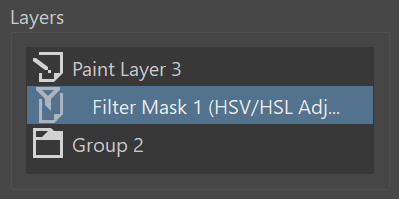

# Layer-Overlay

## What does this plugin do?
A python extension for Krita that adds a small toggleable overlay that shows the current layer you are viewing along with the layer above and below

## Why does this plugin exist?
Krita does already allows you to choose which parts of the window will become hidden when entering canvas only mode. However, those options don't discriminate, for example, which dockers will and will not be hidden

<picture></picture>

>Example image of the layer overlay showing different layer types and the layer hierarchy

## How to use
The default keyboard shortcut is `Ctrl+Shift+X` to make the overlay appear of disappear. The overlay can also be dragged around using the mouse

# Release Notes

[Download](Releases/LayerOverlayExtension%20v0.1.0.zip)

Lastest version: [v0.2.0](Releases/ReleaseNotes.md#v020)

Update notes

+ Fixed positioning bug when switching between canvas only mode and regular mode
+ Overlay is now draggable and can be moved around using the mouse

